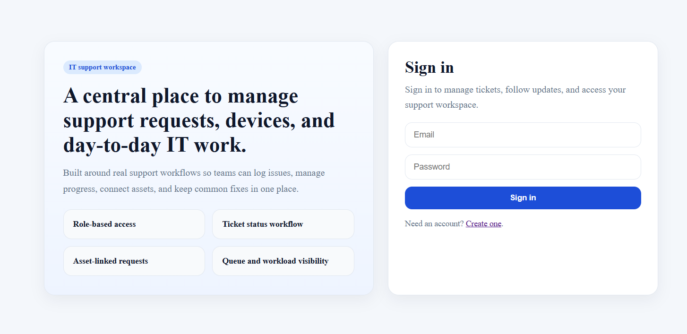
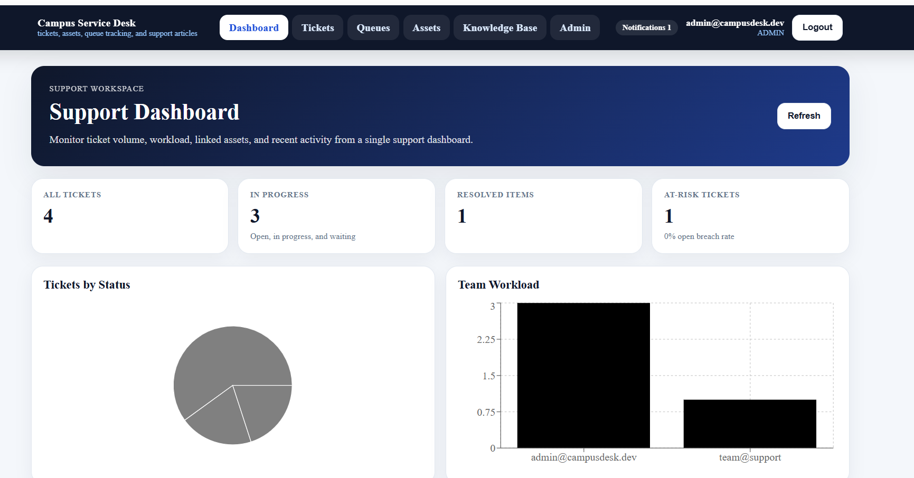
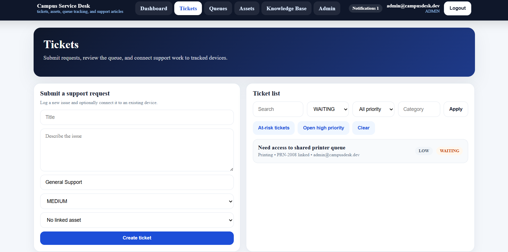
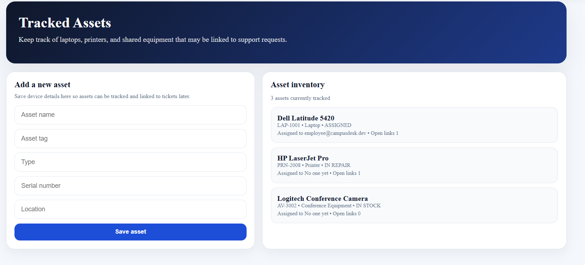
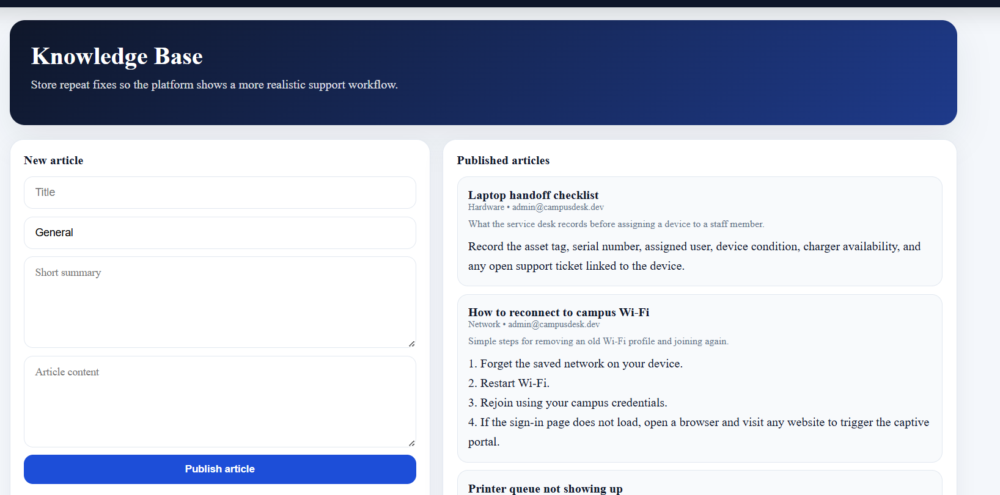

# IT Service Desk & Asset Management System

## Overview
This project is a full-stack IT service desk system designed to model how internal IT teams handle support operations. It includes ticket workflows, automated assignment, SLA monitoring, and asset tracking — similar to real-world tools used in enterprise environments.

The system allows employees to raise support requests, while agents and administrators manage tickets, monitor workloads, and maintain operational visibility.

---

## What This System Demonstrates

- Designing a real-world ticketing workflow with lifecycle management  
- Implementing role-based access control across multiple user types  
- Automating workload distribution using smart assignment logic  
- Tracking SLA performance and system activity using analytics and audit logs  
- Building a secure backend with authentication, validation, and rate limiting  

---

## Key Features

### Ticket Management
- Create and track support requests  
- Full lifecycle: Open → In Progress → Waiting → Resolved → Closed  
- Priority and category-based organization  
- Comments and internal notes for collaboration  

---

### Role-Based Access Control
- **Admin** → full system access  
- **Agent** → manages assigned tickets  
- **Employee** → creates and tracks own tickets  

---

### Smart Assignment (Auto-Assign)
- Automatically assigns new tickets to the **least busy available agent**  
- Balances workload across the support team  
- Reduces manual assignment effort  
- Tracks assignment history for auditing and analytics  

---

### Dashboard & Analytics
- Ticket status distribution (Open / Resolved / At Risk)  
- Agent workload visualization  
- Recent activity tracking  
- SLA monitoring and overdue detection  

---

### Asset Management
- Track devices such as laptops, printers, and equipment  
- Link assets to support requests  
- View assignment and usage history  

---

### Knowledge Base
- Store reusable solutions and troubleshooting guides  
- Simulates real-world support documentation workflows  

---

## Security Features
- Password hashing for secure credential storage  
- JWT-based authentication  
- Role-based authorization for protected routes  
- Rate limiting on authentication endpoints  
- Account lockout after repeated failed login attempts  
- Input validation and request sanitization  
- Audit logging for key system actions  

---

## Architecture

- **Frontend (React + Vite):** Handles UI rendering, state management, and API communication  
- **Backend (Node.js + Express):** Manages business logic, authentication, and API endpoints  
- **Database (PostgreSQL + Prisma):** Stores users, tickets, assets, and system logs  

---

## Tech Stack

### Frontend
- React  
- Vite  
- Recharts  

### Backend
- Node.js  
- Express  

### Database
- PostgreSQL  
- Prisma ORM  

---

## Demo Access

Use these accounts to test different roles:

- admin@campusdesk.dev  
- agent@campusdesk.dev  
- employee@campusdesk.dev  

**Password:** `DemoPass!123`

---

## Screenshots

### Login Page


---

### Dashboard


---

### Tickets Page


---

### Asset Management

---

### Knowledge Page

---
## What I Built/Learned

- Built a full-stack IT service desk platform using React, Node.js, Express, PostgreSQL, and Prisma
- Implemented JWT authentication and role-based access control for Admin, Agent, and Employee users
- Designed ticket lifecycle workflows with SLA tracking and asset linking
- Added security features such as rate limiting, account lockout, audit logging, and input validation
- Improved project structure, UI flow, and documentation to make the system easier to run and demonstrate
---
```md
## Getting Started

# Backend
cd Backend
npm install
copy .env.example .env
npx prisma generate
npx prisma migrate dev
node prisma/seed.js
npm run dev

# Open new terminal

# Frontend
cd Frontend
npm install
npm run dev


