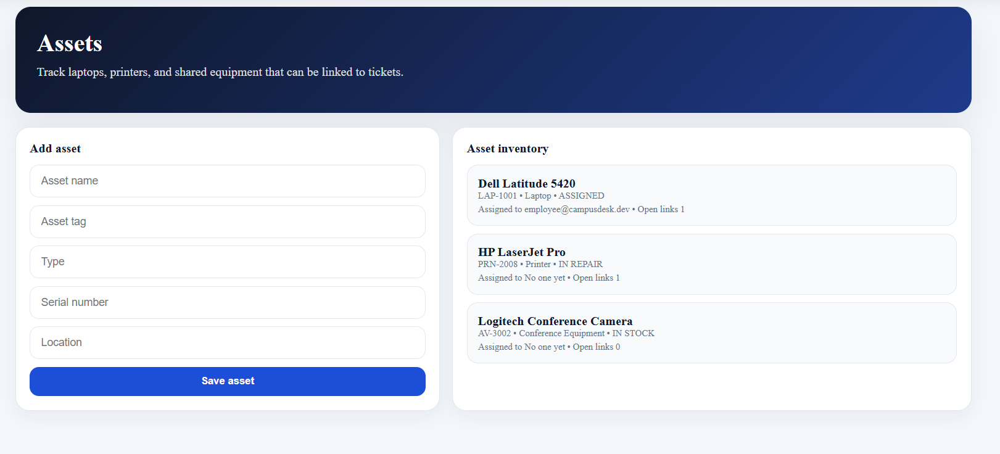

# IT Service Desk & Asset Management System

## Overview
This project is a full-stack IT service desk platform built to simulate how internal support systems work in real companies.

The goal was to go beyond a basic CRUD application and design something closer to tools like Jira Service Management or Freshdesk. The system allows employees to raise support requests, agents to manage and resolve them, and admins to monitor activity across the platform.

---

## Key Features

### Ticket Management
- Create and track support requests
- Full ticket lifecycle: Open -> In Progress -> Waiting -> Resolved -> Closed
- Priority and category-based organization
- Comments and internal notes for collaboration

### Role-Based Access Control
- Admin -> full system access  
- Agent -> manages assigned requests  
- Employee -> creates and tracks own requests  

### Smart Assignment (Auto-Assign)
- New tickets are automatically assigned to the **least busy available agent**
- Balances workload across the support team
- Reduces manual assignment effort
- Assignment is tracked in ticket history and reflected in dashboard analytics

### Dashboard & Analytics
- Ticket status distribution (Open / Resolved / At Risk)
- Agent workload visualization
- Recent activity tracking
- SLA monitoring

### Asset Management
- Track devices such as laptops, printers, and equipment
- Link assets to support requests
- View assignment and usage details

### Knowledge Base
- Store reusable solutions and troubleshooting guides
- Helps simulate real support workflows

---

## Security Features
- Password hashing for secure credential storage
- JWT-based authentication
- Role-based authorization for protected routes
- Rate limiting on authentication endpoints
- Account lockout after repeated failed login attempts
- Input validation and request sanitization
- Audit logging for key system actions

---

## Tech Stack

### Frontend
- React  
- Vite  
- Recharts  

### Backend
- Node.js  
- Express  

### Database
- PostgreSQL  
- Prisma ORM  


## Demo Access

Accounts to test different roles:

- admin@campusdesk.dev  
- agent@campusdesk.dev  
- employee@campusdesk.dev  

**Password:** `DemoPass!123`

## Screenshots

### Login Page


---

### Dashboard


---

### Tickets Page


---

### Asset Management

---

### Knowledge Page

---
## What I Built/Learned

- Built a full-stack IT service desk platform using React, Node.js, Express, PostgreSQL, and Prisma
- Implemented JWT authentication and role-based access control for Admin, Agent, and Employee users
- Designed ticket lifecycle workflows with SLA tracking and asset linking
- Added security features such as rate limiting, account lockout, audit logging, and input validation
- Improved project structure, UI flow, and documentation to make the system easier to run and demonstrate
---
```md
## Getting Started

```bash
# Backend
cd Backend
npm install
copy .env.example .env
npx prisma generate
npx prisma migrate dev
node prisma/seed.js
npm run dev

# Open new terminal

# Frontend
cd Frontend
npm install
npm run dev


